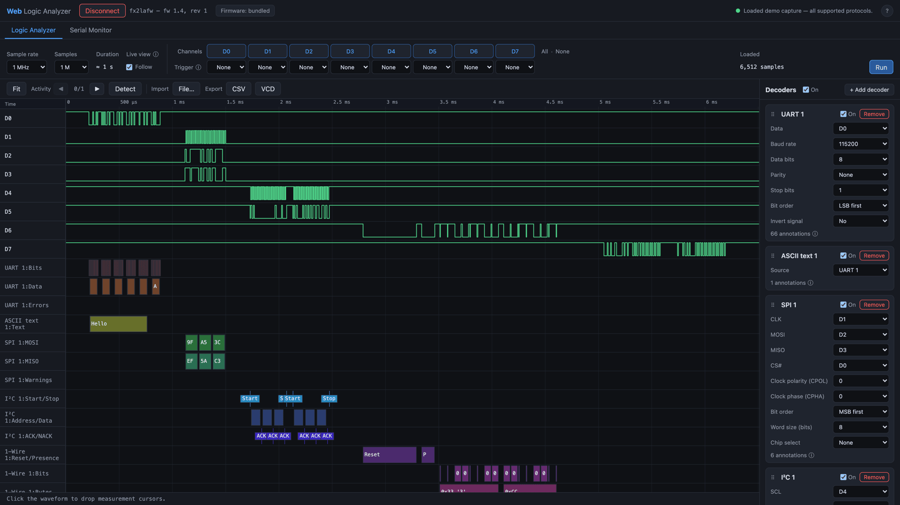
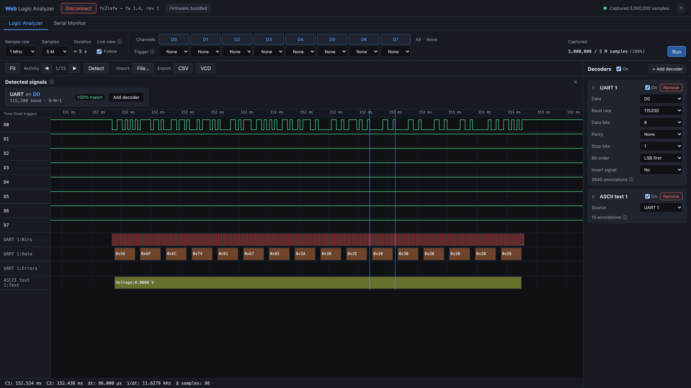
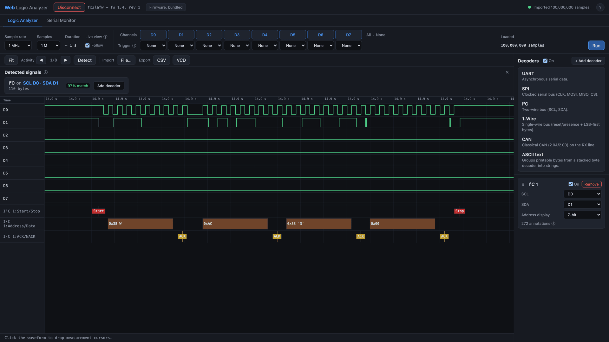
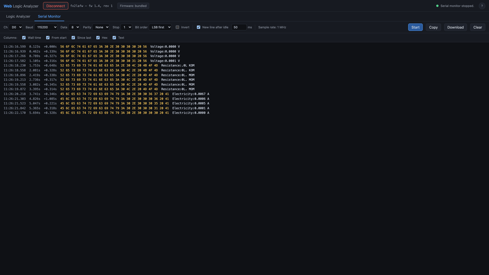

# Web Logic Analyzer

**A logic analyzer that runs entirely in your browser — no drivers, no install.**
Plug in a cheap FX2LP-based analyzer, open a tab, and capture, visualize, and decode
digital signals over **WebUSB**.

### ▶ [Open the app →](https://lassebm.github.io/web-logic-analyzer/)

Runs in Chrome, Edge, or Brave — WebUSB is Chromium-only (see [Browser support](#browser-support)).
Nothing to install; the app uploads the device firmware for you. New here? Jump to
[Getting started](#getting-started).

It drives the same FX2LP boards that [sigrok/PulseView](https://sigrok.org) support
through their `fx2lafw` driver — but where PulseView is a native app you install per machine, this
is a single web page: nothing to compile, nothing to set up, and the app even uploads
the device firmware for you. Open it on any machine with Chrome and go.



_The built-in demo capture — a short exchange on every supported protocol, fully decoded, no hardware required._

## Getting started

1. **[Open the app](https://lassebm.github.io/web-logic-analyzer/)** in Chrome (or Edge /
   Brave). Prefer to run it yourself? See [Development](#development).

   > **No hardware?** Open the **?** menu (top right) and click **Load demo capture** to
   > explore the whole app — waveform, decoders, and auto-detect — with a sample capture
   > covering every protocol.

2. Plug in an FX2LP board — a cheap "nanoDLA" / Saleae clone (e.g. VID:PID `0925:3881`).
3. Click **Connect device** and pick your board in Chrome's device chooser. The matching
   firmware uploads automatically and the device re-enumerates — no driver install. (Only
   load a custom `.fw` via **Firmware** if your board isn't auto-detected.)
4. Set the sample rate, active channels, and sample count, then click **Run** to capture.
5. **Decode:** click **Detect** to auto-add a UART or I²C decoder, or add one manually from
   the decoder panel and map it to a channel. Click the waveform to drop measurement cursors
   (Δt, frequency, sample delta).
6. **Export** to CSV or VCD (VCD opens in GTKWave / PulseView), or **Import** a saved
   CSV/VCD back in for offline review.

> **Device not listed in the chooser?** WebUSB needs the right OS-level driver binding —
> see [Browser support](#browser-support) (Windows needs WinUSB via Zadig).

## Features

At a glance: **capture** up to 24 MHz over WebUSB, **view** 8 channels on a zoomable
canvas, **auto-detect** UART & I²C signals, **decode** UART / SPI / I²C / 1-Wire / CAN,
and **import / export** CSV / VCD — all in the browser, with the device firmware uploaded
for you.

- **WebUSB connection** — automatic firmware upload and re-enumeration, and it notices
  when the device is unplugged and resets cleanly.
- **Configurable capture** — sample rate (20 kHz–24 MHz), active channels, sample count
  (10k up to 100M for long captures).
- **Software trigger** — per-channel rising/falling/level, matching sigrok's model (the
  FX2 has no hardware trigger, so it's done client-side).
- **Waveform viewer** — 8 channels, trigger-relative time ruler, zoom (Ctrl/⌘+wheel) and
  pan (drag, horizontal swipe, or Shift+wheel), zoom-to-fit, and an activity pager: `▶`
  jumps to the first region of signal and steps through the rest, showing your position
  (e.g. `2/5`). Rendering stays fast and keeps narrow edges visible even on 100M-sample
  captures.
- **Follow (live view)** — while capturing, keep the newest activity framed at a readable
  zoom (a UART burst is framed whole, a continuous signal rolls) instead of watching the
  whole capture shrink. Toggle it off for a fixed view. Either way it fits the whole
  capture when the run stops.
- **Measurement cursors** — click to drop cursors; read Δt, frequency, and sample delta.
- **Editable baud** — the UART decoder and Serial Monitor pick baud from common presets
  or take any custom value (a preset dropdown with a "Custom…" entry).
- **Protocol auto-detection** — one click scans the active channels and adds a
  pre-configured decoder for what it finds. For **UART** it recovers each line's baud rate
  and frame format (data bits, parity, inversion), trial-decoding standard baud rates and
  scoring framing so it also weeds out lines that _aren't_ UART. For **I²C** it identifies
  the two-wire bus and works out which line is the clock (SCL) and which is data (SDA), so
  the decoder is wired up the right way round for you — and it won't be fooled into pairing
  up unrelated lines when several protocols share a capture.
- **Protocol decoders** — UART, SPI, I²C, 1-Wire, and CAN, plus a stackable ASCII decoder,
  and a small TypeScript plugin API for adding your own. Fast even on large captures. Decode
  **live while capturing**, toggle decoders on/off individually or all at once to focus on a
  subset, and drag decoders by their handle to reorder their lanes.
- **Stacked decoders** — some decoders feed others: the ASCII decoder assembles the bytes
  from UART / SPI / I²C into printable text.
- **Export** to CSV and VCD (opens in GTKWave / PulseView), with a progress readout —
  even a 100M-sample capture saves without freezing the tab.
- **Import** a CSV or VCD capture back in for offline review, large files included. A VCD
  saved by this app reloads exactly as captured; a VCD from another tool reloads as
  faithfully as the format allows.
- **Serial Monitor** — a continuous-capture UART terminal in its own tab (the FX2 captures
  one thing at a time, so it's a mode, not an overlay), with full UART settings and
  toggleable columns (timestamps, raw hex, text). A new line starts on a line-feed and,
  optionally, after an idle gap; memory stays bounded automatically.
- **Demo capture** — no hardware required: **Load demo capture** from the **?** menu drops
  in a sample recording with a short exchange on every protocol and every decoder pre-wired,
  so you can try the whole app in seconds.

## Screenshots



_Capturing UART on real hardware — auto-detected at 115200 8-N-1, decoded to ASCII, with measurement cursors._



_A 100M-sample I²C capture imported from VCD — the bus is auto-detected and a decoder added, with the full decoder list on the right._



_The Serial Monitor on real hardware, all columns enabled (wall time, from start, since last, hex, text)._

## Browser support

WebUSB is **Chromium-only** — use Chrome, Edge, Brave, or similar. Firefox and Safari
do not implement WebUSB.

On **Windows**, the device must be bound to the WinUSB driver for WebUSB to open it.
If the device isn't detected, use [Zadig](https://zadig.akeo.ie/) to install WinUSB on
the interface (this is the same requirement PulseView has on Windows). On Linux you may
need a udev rule granting access; on macOS it works out of the box.

## Firmware

The app **bundles the `fx2lafw` firmware** (sigrok-firmware-fx2lafw 0.1.7) and
auto-selects the right image by the device's USB VID:PID — so for supported boards it
works out of the box: just **Connect device**. If the device already runs fx2lafw (its
USB strings read `sigrok` / `fx2lafw`), the upload step is skipped automatically.

You can override with your own image via **Firmware → Load custom .fw…** (cached in the
browser's IndexedDB); "Use bundled" removes it again.

### Licensing

The bundled firmware is **GPLv2-or-later** (sigrok-firmware-fx2lafw). It is a separate
program that runs on the FX2 chip; this app ships it unmodified as data and uploads it to
the device (mere aggregation), which does not place this application under the GPL. The
license texts are included in [`third-party/`](./third-party), along
with a pointer to (and written offer for) the complete corresponding source. Upstream
source: <https://sigrok.org/download/source/sigrok-firmware-fx2lafw/sigrok-firmware-fx2lafw-0.1.7.tar.gz>.

## Development

```bash
npm install
npm run dev           # serves at http://127.0.0.1:5173 (localhost is a secure context)
npm run check         # type-check (svelte-check)
npm test              # unit + component tests (vitest)
npm run test:coverage # tests with a v8 coverage report
npm run build         # type-check + production build to dist/
npm run preview       # serve the production build locally
```

### Deployment

Pushing to `main` runs the [GitHub Pages workflow](.github/workflows/deploy.yml), which
type-checks, builds, and publishes `dist/` to
<https://lassebm.github.io/web-logic-analyzer/>. The Vite `base` is relative (`./`), so the
same bundle runs unchanged at that sub-path or from `npm run preview` locally. WebUSB needs
a secure context — Pages serves over HTTPS, which satisfies it.

## Architecture

```
src/usb/      WebUSB wrapper, protocol constants, firmware upload, capture streaming
src/firmware/ bundled fx2lafw .fw images + loader
src/model/    CaptureBuffer (packed samples), software trigger, activity clusters
src/decode/   decoder plugin API + edge-jumping engine + decoders (uart, spi, i2c, onewire, can, ascii) + protocol auto-detection
src/view/     canvas renderer (waveform, time ruler, annotation lanes)
src/ui/       Svelte components
src/stores/   session store + capture/decode/monitor orchestration
src/monitor/  serial-monitor terminal line assembly
src/export/   CSV + VCD writers + chunked streaming download
src/import/   CSV + VCD parsers + streaming file importer
src/demo/     built-in no-hardware demo capture (all protocols)
```

Protocol details (firmware-load request `0xA0`, CPUCS `0xE600`, `CMD_START` config,
sample-rate encoding, bulk endpoint discovery) are documented inline in
`src/usb/constants.ts`, `firmware.ts`, and `sampleRate.ts`, sourced from libsigrok.

Large captures stay responsive through two structures: an incremental **min/max pyramid**
in `CaptureBuffer` makes zoomed-out rendering O(log n), and the decode engine jumps between
edges via a cached **transition index** instead of scanning every sample. Live features
(the follow view, in-view decode) operate on a bounded on-screen window so per-chunk work
stays O(chunk) and never stalls the capture stream.

### Adding a decoder

Implement the `Decoder` interface (`src/decode/types.ts`) and register it in
`src/decode/registry.ts`:

- **Logic decoder** — a generator that `yield`s wait conditions (`{0: 'f'}`, `{skip: n}`,
  or an OR-list) and receives pin state, calling `ctx.put(...)` for annotations and
  `ctx.emit(...)` to produce `byte` packets for stacking. See `decoders/uart.ts` (edges +
  skips), `decoders/i2c.ts` (OR-matched conditions), `decoders/can.ts` (bit destuffing),
  and `decoders/onewire.ts` (pure edge-interval timing).
- **Stacked decoder** — set `meta.inputType` and implement `decodeStacked(packets, ctx)`.
  See `decoders/ascii.ts`.

## AI usage

AI was used extensively across this project — to work through the FX2 / `fx2lafw`
USB protocol, and to write the WebUSB layer, the protocol decoders, the Svelte UI,
the tests, and this documentation. None of it is guesswork: the device handling
follows libsigrok / `fx2lafw`, and the whole capture-to-decode path has been
validated end to end on real FX2LP hardware.

## License

This project's own code is licensed under the **MIT License** — see [`LICENSE`](./LICENSE).

The firmware images bundled under `src/firmware/` are **not** MIT: they are
sigrok-firmware-fx2lafw (GPLv2-or-later), a separate program uploaded to the
device. See [`third-party/`](./third-party) for the license
texts and the corresponding-source pointer.
